# Table of contents

- [Set up for local development](#set-up-for-local-development)
- [OpenAI secret](#openai-secret)
- [Adobe PDF Services secrets](#adobe-pdf-services-secrets)
- [Google Cloud Storage secrets](#google-cloud-storage-secrets)
- [Github secrets](#github-secrets)
- [Streamlit Cloud](#streamlit-cloud)
- [Google Cloud Storage](#google-cloud-storage)
- [Updating the database](#updating-the-database)
- [Quick links](#quick-links)

# Set up for local development

We use `python-dotenv` to load secrets from a `.env` file into the environment. 


Create a `.env` file in the root directory

```
├── function
│   ├── ....
├── pipelines
│   ├── ...
├── .env # <--- here
├── app.py
├── packages.txt
├── ...
```

containing something like this:

```
# OpenAI
OPENAI_API_KEY=sk-proj-zGBOFujkl-...

# Adobe PDF Services
ADOBE_CLIENT_ID=bd7a6964a749b6...
ADOBE_CLIENT_SECRET=p9e-uF9zg...

# Google Cloud Storage
GOOGLE_APPLICATION_CREDENTIALS="/Users/bobby/Documents/001-wedding-venue/turing-guard-454623-t7-2ci0v965a132.json"
```

# OpenAI secret

You can get an OpenAI API key from [here](https://platform.openai.com/api-keys).

# Adobe PDF Services secrets

You can get an Adobe PDF Services API key from [here](https://acrobatservices.adobe.com/dc-integration-creation-app-cdn/main.html?api=pdf-extract-api).

create credentials

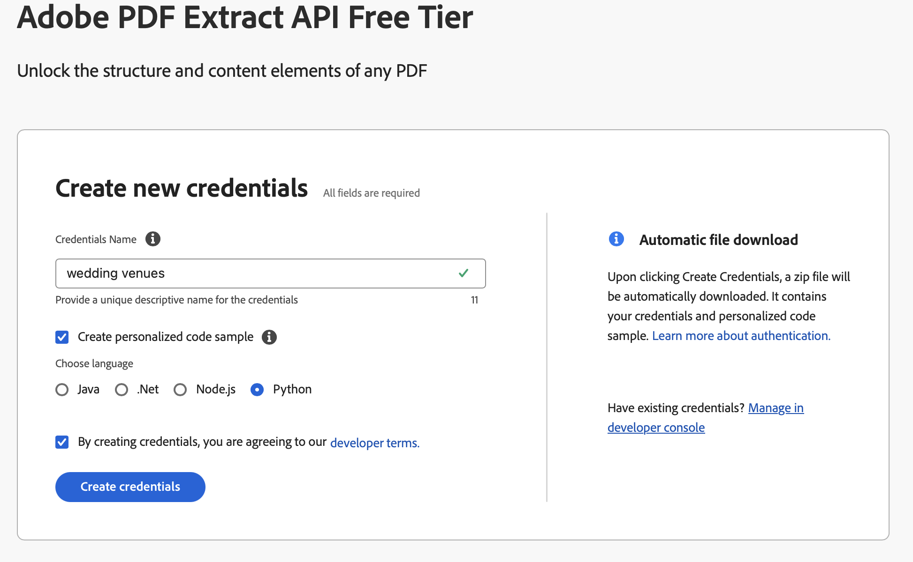

This will download a zip file containing a `pdfservices-api-credentials.json` file. 

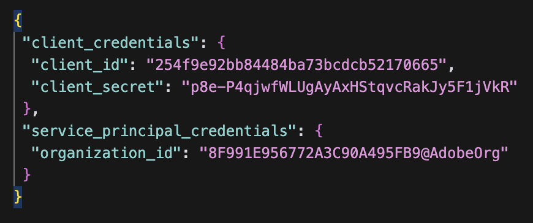


# Google Cloud Storage secrets

create service account in Google Cloud Console

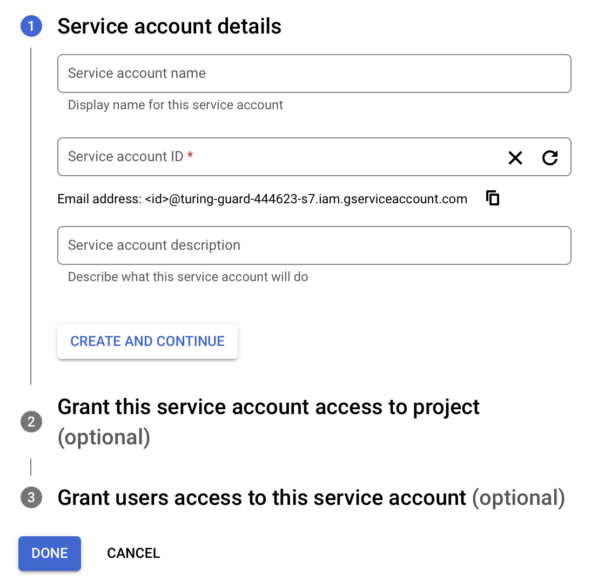

Skip the optional fields and steps and press "Done".

Next, select the service account you just created and press the "Keys" tab.

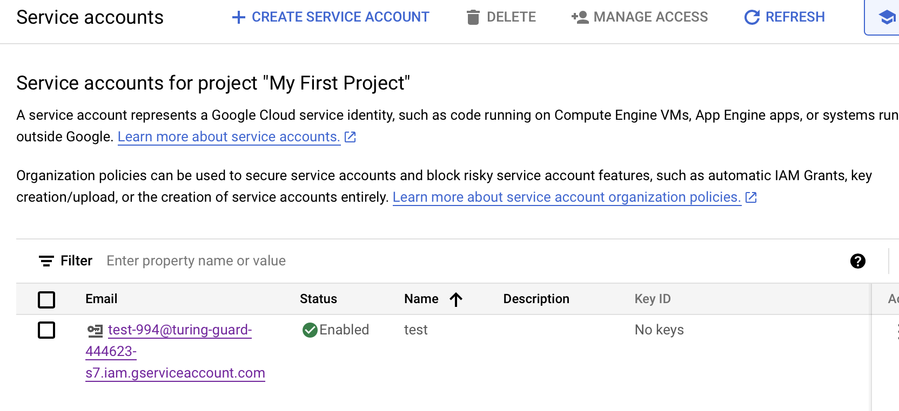

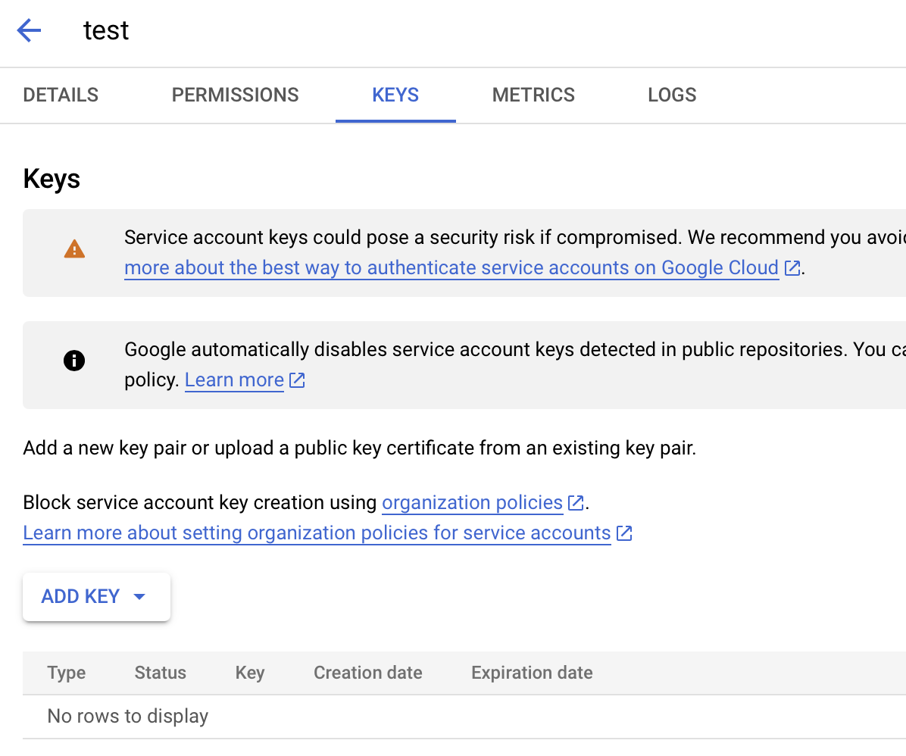

Then click "Add Key" and select "JSON" as the key type

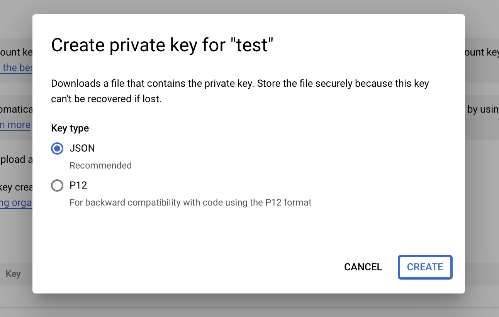

This will download a JSON file to your computer. Move this file to the root directory of the project (next to `.env`). 

Then inside `.env`, set the `GOOGLE_APPLICATION_CREDENTIALS` to the path of the JSON file you just downloaded. 

# Github secrets

Go to the repository settings and click "Secrets and variables > Actions".

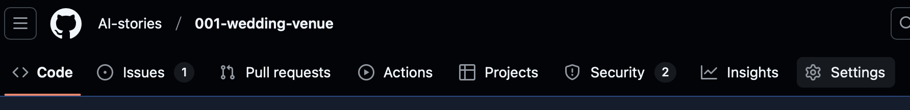

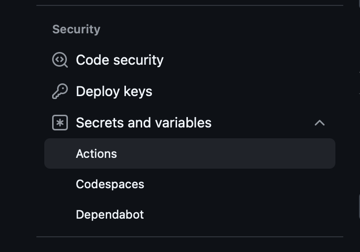

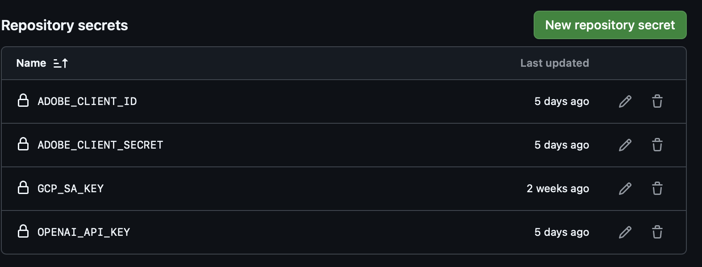

Then add 4 new repository secrets:

- `ADOBE_CLIENT_ID`
- `ADOBE_CLIENT_SECRET`
- `OPENAI_API_KEY`
- `GCP_SA_KEY`

The first three are the same as the ones as described in the previous section. The `GCP_SA_KEY` will contain the contents of the JSON file that we just downloaded, something like:

```json
{
  "type": "service_account",
  "project_id": ...,
  "private_key_id": ...,
  "private_key": ...,
  "client_email": ...,
  "client_id": ...,
  "auth_uri": ...,
  "token_uri": "https://oauth2.googleapis.com/token",
  "auth_provider_x509_cert_url": "https://www.googleapis.com/oauth2/v1/certs",
  "client_x509_cert_url": ...,
  "universe_domain": "googleapis.com"
}
```

# Streamlit Cloud

On Streamlit Cloud, you will have to set the openai key and google cloud credentials as secrets. After logging in, go to "My Apps", select the app, go to "Settings" and then "Secrets".

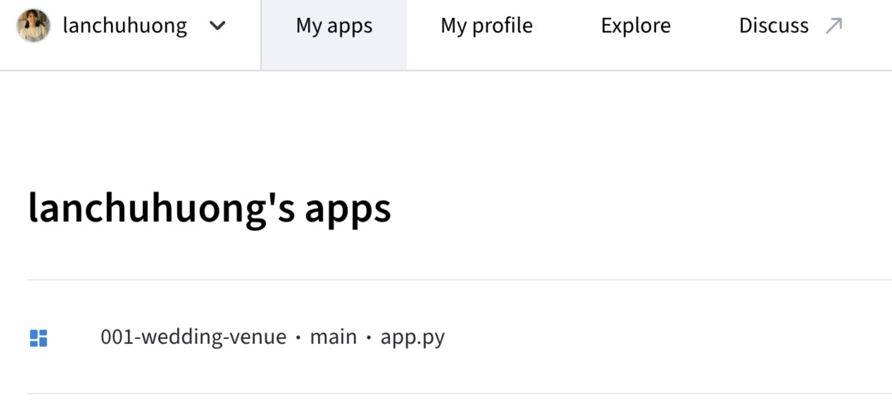
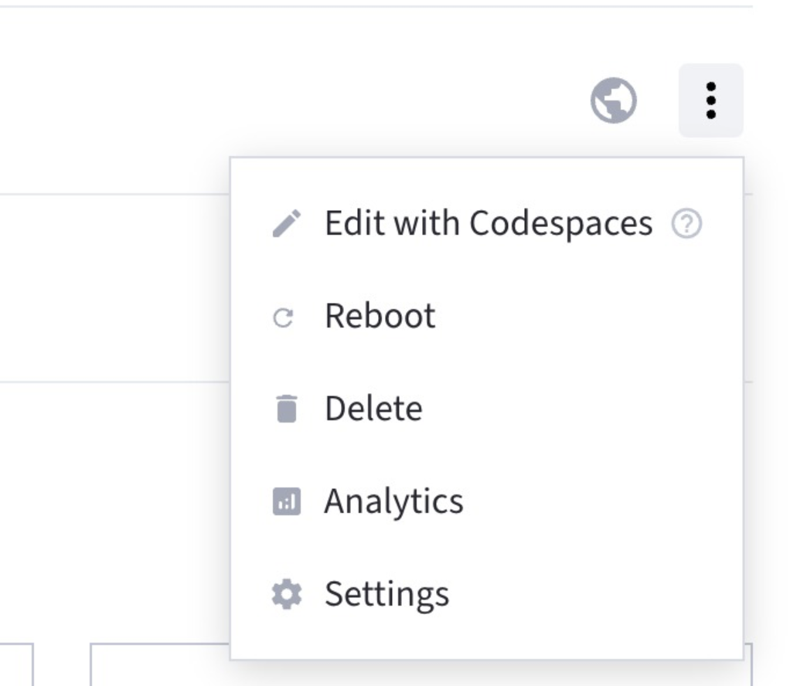
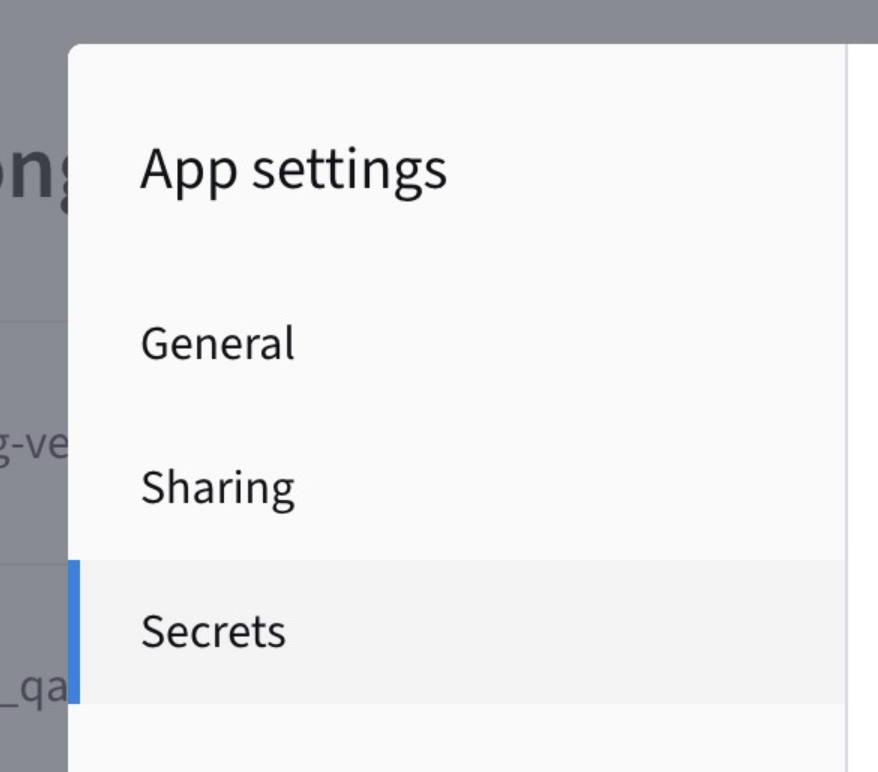
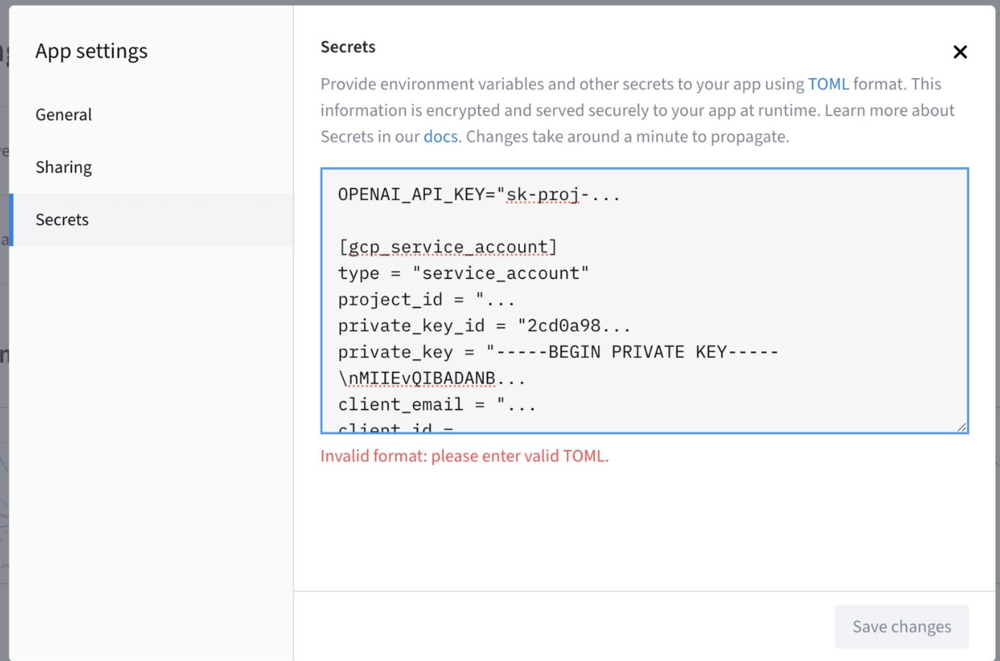

Here you will fill in the two secrets as before, but a slighly different format:

```toml
OPENAI_API_KEY="sk-proj-zGBOFujkl-..."

[gcp_service_account]
type = "service_account"
project_id = ...
private_key_id = ...
private_key = ...
client_email = ...
client_id = ...
auth_uri = "https://accounts.google.com/o/oauth2/auth"
token_uri = "https://oauth2.googleapis.com/token"
auth_provider_x509_cert_url = ...
client_x509_cert_url = ...
universe_domain = "googleapis.com"
```

Under the `[gcp_service_account]` section, you again put in the contents of the JSON file, but this time you omit the `{` and `}`, don't write the `,` and the end of each line, and just put the contents of the JSON file.

# Google Cloud Storage

The vector database, PDFs, and images are stored in Google Cloud Storage in a bucket called [wedding-venues-001](https://console.cloud.google.com/storage/browser/wedding-venues-001). 


The structure is roughly:

```
wedding-venues-001/
├── venues/
│   ├── venue_1/
│   │   ├── venue_1.pdf
│   ├── venue_2/
│   │   ├── venue_2.pdf
│   ├── ...
├── processed/
│   ├── adobe_extracted/
│   │   ├── venue_1/
│   │   │   ├── figures/
│   │   │   ├── tables/
│   │   │   ├── structuredData.json
│   │   ├── venue_2/
│   │   │   ├── ...
│   │   ├── ...
│   ├── ...
├── faiss_db/
├── Wedding Venues.xlsx
├── image_tracker.json
```

New PDFs are added to the `wedding-venues-001/venues` folder, and extra info (phone, address, website, new images) is added to the `Wedding Venues.xlsx` file. When processed, the extracted/downloaded information is stored in 'processed/' and in the vectore database (`faiss_db/`).

# Updating the database

Every night at 03:00 AM (PST), a script is run on Github Actions that:

- Check for new PDFs in `wedding-venues-001/venues` and
  - Process them using Adobe PDF Services and store text, tables and images in `wedding-venues-001/processed/adobe_extracted/{venue}/...`
  - Extract venue information (phone, address, website) from `wedding-venues-001/Wedding Venues.xlsx`
  - Download and save images from `wedding-venues-001/Wedding Venues.xlsx` to `wedding-venues-001/processed/adobe_extracted/{venue}/figures/`
    - If the image contains mostly text or a logo, we automatically delete the image.
  - Store text, table, image data in vector database.
- Check for removed PDFs in `wedding-venues-001/venues` and
  - Remove all related information from the vector database.

Checking if everything is up to date takes a few minutes, and processing a single new PDF takes about a minute. 

If something is updated, the streamlit app will reload and during a few minutes users cannot use the app. The database can also be updated sooner by manually running the Github Action:

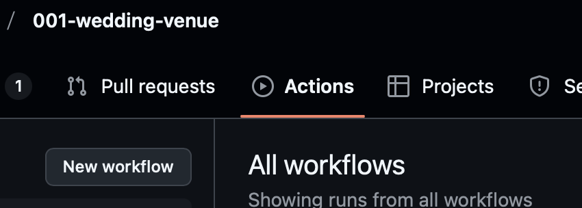

click "update wedding venue database"

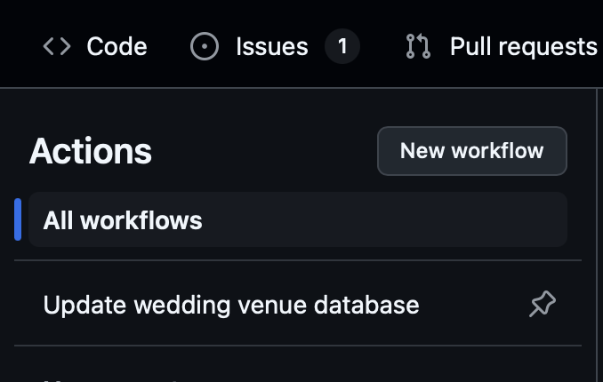

then click "Run workflow > Run workflow"

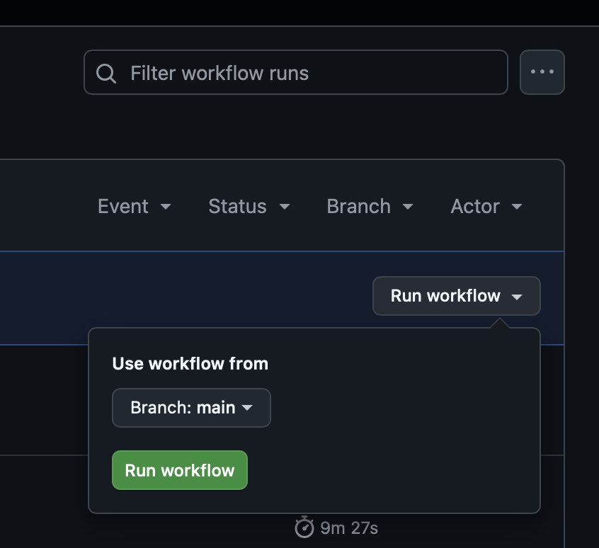

After a few seconds, a new workflow will appear

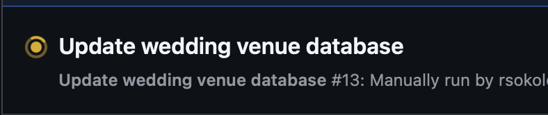


# Quick links

- [Google Cloud Storage](https://console.cloud.google.com/storage/browser/wedding-venues-001)
- [Streamlit Cloud](https://share.streamlit.io)

